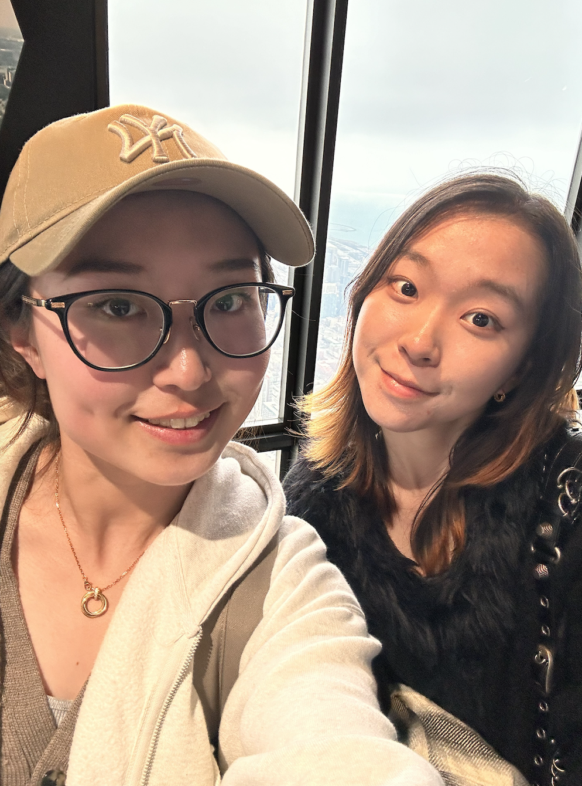

# Welcome to Teresa's User Page

## About Me
```
I'm a programmer who is passionate about open-source projects and web development.
```

### Skills

- **Programming Languages**: Python, Java, C++, JavaScript, C, Assembly, HTML, CSS. 
- **Frameworks**: React. 
- **Tools**: Git, MATLAB, Eclipse, VSCode.

### Projects

1. [Supervised Machine Learning Project](https://example.com) - A brief description of the project.
2. [Data Science Research Project](https://drive.google.com/file/d/1Zw-pNmCZJzKK4eoqQD8Uy3n40sGu0slP/view?usp=drive_link) - Another brief description.

### Contact

- GitHub: [my GitHub](https://github.com/tsatn/CSE110_Spring24)
- LinkedIn: [my LinkedIn](https://www.linkedin.com/in/teresa-tian/)

> I learned how to write this **Markdown file** here: [Markdown formatting syntax](https://docs.github.com/en/get-started/writing-on-github/getting-started-with-writing-and-formatting-on-github/basic-writing-and-formatting-syntax)

### Pictures
[link to my picture](meee.png)

- [x] its the same picturee :P
- [x] its the same picturee :P
- [x] its the same picturee :P
  
- :o 
- :O
- :o
- :O
  
[I'm also here](#meee)

# meee 



